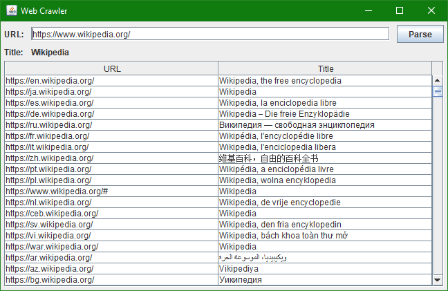

# Web Crawler
In this project, you will develop an application that scans Internet pages and saves their titles. You can use titles later to implement your own search engine.

## What Will You Learn?
- Create a Java application with a Graphical User Interface (GUI).
- Use a standard library to download HTML pages.
- Create a regular expression to parse a simple HTML code.
- Store data in collections.
- Save files on disk.
- Work with multiple threads.
- Compute time.
- Handle errors.
- Use Git to manage code versions.
- Refactor code.

## Stages
### 1. GUI
#### Learn topics
- [GitHub via IntelliJ IDEA](https://hyperskill.org/learn/lesson/162503).
- [Objects](https://hyperskill.org/learn/lesson/51355).
- [The keyword super](https://hyperskill.org/learn/lesson/64089).

#### Description
Let's begin implementing the bot.

To start this project, first, fork our GitHub repository: [TODO]().

```java
package webcrawler;

import javax.swing.*;

public final class SimpleWindow extends JFrame {
    public SimpleWindow() {
        setDefaultCloseOperation(JFrame.EXIT_ON_CLOSE);
        setSize(300, 300);
        setVisible(true);
        setLayout(null);
    }
}
```

In Swing, the class that represents an empty window is `JFrame`. Actually, all of the classes that represent graphic elements in Swing start with the letter `J`. Don't confuse these classes with classes that represent graphic elements of the AWT library (for example, the class `Button` in the AWT library versus the class `JButton` in the Swing library).

To improve the basic window, you should extend `JFrame` class and write your own logic for the window. Let's see this code below in the constructor of `SimpleWindow` class that extends `JFrame`:

```java
setDefaultCloseOperation(JFrame.EXIT_ON_CLOSE);
setSize(300, 300);
setVisible(true);
setLayout(null);
```

Without the first line, if you close the program, your program would be still running, and after that, you can only kill it using the task manager or the IDE (if you are running it under an IDE).

The second line sets the size of the window. Without it, the program would be 0 pixels in width and height. Of course, nothing can fit in this window size. And if you run the program, you would see nothing because the window is invisible by default. The third line fixes this. The fourth line means that there won't be any strategy for placing the elements on the screen. You can place components on the window using absolute coordinates and bounds.

You can place any component anywhere using `component.setLocation(int x , int y)` and `component.setSize(int width, int height)`. If you want to change both the size and the location of the component, you may want to use `component.setBounds(int x, int y, int width, int height)`. To add a Swing component to the window, you need to invoke the add method and pass the component as a parameter. For example: `add(component)`.

Also, you can use the method `setTitle` to set the name of the window.

You can find the list of components [here](http://zetcode.com/tutorials/javaswingtutorial/basicswingcomponents/) and [here](http://zetcode.com/tutorials/javaswingtutorial/basicswingcomponentsII/). In this stage, you need to use the most suitable component for displaying a web page code: `JTextArea`. For now, place a static text into the `JTextArea` and make it disabled.

Send the link to your pull request on GitHub with the solution after each stage of this project.

#### Example
Below there is the example of how your basic window might look:


### 2. Download a page
#### Learn topics
[Exception handling](https://hyperskill.org/learn/lesson/57387).

#### Description
Now let's download a source code of the given web page.

Rename your `SimpleWindow` class to `WebCrawlerWindow` (you can do it fast: click the right mouse button on the `SimpleWindow` class, then choose "Refactor" - "Rename", and the class will be renamed everywhere).

Next, add two components to the frame: a `JTextField` for the target site URL and a `JButton` launching download. 

And how to download a web page?

There are standard Java classes.

Here is an algorithm downloading a web page text:
```java
final String url = /* Get url from JTextField */;

final InputStream inputStream = new URL(url).openStream();
final BufferedReader reader = new BufferedReader(new InputStreamReader(inputStream, StandardCharsets.UTF_8));
final StringBuilder stringBuilder = new StringBuilder();

String nextLine;
while ((nextLine = reader.readLine()) != null) {
    stringBuilder.append(nextLine);
    stringBuilder.append(LINE_SEPARATOR);
}

final String siteText = stringBuilder.toString();
```

1. Firstly, the link is stored in the `url` variable.
1. Then the input stream is created.
1. After that, there is a creation of the stream reader: we specify the most common charset here.
1. Then the reader reads the site text line-by-line to the `StringBuilder` (it has a faster appending performance compared to simple string concatenation).
1. Finally, the `StringBuilder` saves the site text to a single string.

Please note that this algorithm requires some more code.
- You need to import `java.io.*`, `java.net.URL` and `java.nio.charset.StandardCharsets`.
- Line separator can be retrieved by `LINE_SEPARATOR = System.getProperty("line.separator")`.
- The code should be placed into `try-catch` construction to handle checked exceptions.

#### Example
Below there is the example of how your window might look:


### 3. Page title
#### Learn topics
[Match results](https://hyperskill.org/learn/lesson/98341).

#### Description
As you see on the previous stage, an HTML code contains many symbols `<` and `>`. These symbols declare tags. So HTML consists of tags. There are two types of tags:
- Tags-containers like pairs of a start-tag `<title>` and an end-tag `</title>` (this one is used to set a page title). Usually, there is a content placed inside containers. 
- Empty-element tags like `` (this one is used for inserting images). The only way to customize these tags is attributes addition.

Start-tags and empty-element tags can contain attributes. Attributes are pairs of attribute name and attribute value. You see attribute `src="LINK"` in `img` tag. It can also be written as `src='LINK'`.

You can read more about HTML for example [here](https://en.wikipedia.org/wiki/HTML).

Implement parsing of the site title. Find the `<title>` tag in the site text and output it to a special component. You can use a regular expression to catch that simple string.

Enhance your window: add some more components.

#### Example
Below there is an example of how your new window might look. Here site has tag `<title>Example Domain</title>`:


### 4. Links on site
#### Learn topics
- [Map](https://hyperskill.org/learn/lesson/53858).
- [Multi-dimensional array](https://hyperskill.org/learn/lesson/51354).

#### Description
Continue developing the crawler: let's collect all the links to other web pages on the page and their titles.

As you may know, links in HTML are tags like `<a href="LINK">`, where `LINK` is obviously an URL and quotes can be single (`'`) or double (`"`).

The link can be presented in many ways:
- An absolute link like `https://www.wikipedia.org/index.html`.
- A relative link like `page.html`. It doesn't contain slashes. To get an absolute link you should cut the original link to the last slash and add this relative link: `https://www.wikipedia.org/index.html` => `page.html` = `https://www.wikipedia.org/page.html`.
- A link without protocol like `//en.wikipedia.org/` or `en.wikipedia.org/`. Here you need just to add protocol of original page: `http` or `https`.

Don't forget that there are not only links to web pages. Also, there are images, music, video, and so on. Handle these cases: update page download code. `URL`'s `openStream()` method is a shorthand for `openConnection().getInputStream()`. So receive an object `URLConnection` by `openConnection()` and check its `getContentType()`. It must be equal to `"text/html"`. Then use `.getInputStream()` to pass the connection to the `InputStreamReader`.

Then display a `JTable` with this data: the first column is the link, the second one is its title.

Put the `JTable` in a `JScrollPane` so the `JTable` header will be shown.

#### Example
Below there is the example of how your new window might look:



### 5. Dump results
#### Learn topics
[Writing files](https://hyperskill.org/learn/lesson/90826).

#### Description
Implement the table export: this is useful for sending results to another computer or for processing results in another program. Add a button to save file on disk. Also, add a text field where the file path will be written.

You can write a file like a set of pairs of lines: every odd line contains a link and the following (even) line contains the title of the web page by the link.

Also, you can update the way you've been creating the `URLConnection` to disguise as a human because many sites can send a wrong HTML code if they understand that the query is sent by a bot. The aim is to specify `user-agent` property as the property in common browser.

Do `.setRequestProperty("User-Agent", "Mozilla/5.0 (Windows NT 10.0; Win64; x64; rv:63.0) Gecko/20100101 Firefox/63.0")` for an `URLConnection` object. It's like Firefox running on Windows 10. So most sites will treat the bot as a human.

#### Example
Below there is the example of how your new window might look:


### 6. Web crawler
#### Learn topics
- [Comparing dates and time](https://hyperskill.org/learn/topic/110).
- [Concurrent queues](https://hyperskill.org/learn/topic/305).

#### Description
At the final stage, implement a real web crawler!

We suggest you use the following algorithm.

Create some threads-workers which wait for new tasks in the task queue. A task is an URL. If a thread-worker gets a task, it goes to the page, saves its title, collects all links on the page, and adds this links as new tasks to the task queue.

So links and titles will be [breadth-first searched](https://en.wikipedia.org/wiki/Breadth-first_search).

Don't forget to exclude already visited pages from new tasks as they add redundant work.

To sum up, add the following components to your window:
- The number of threads-workers.
- Two checkable restrictions:
    - Maximum crawling depth: if enabled, workers won't go too deep in the Internet.
    - Time limit: if enabled, workers won't add tasks after the given time.
- A `JToggleButton` Run/Stop to toggle crawling process (the button should deactivate automatically if a restriction becomes valid or there is no task in the task queue).
- Metrics like elapsed time and parsed page count.

#### Example
Below there is the example of how your new window might look:


